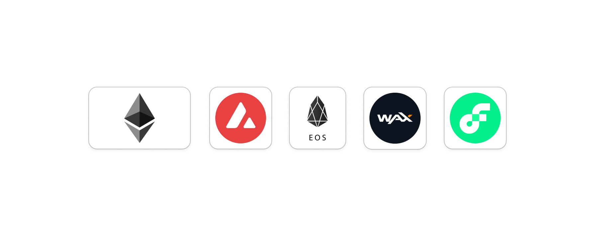
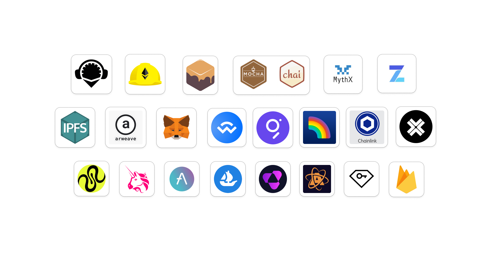
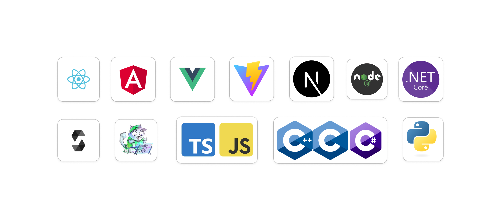

<h2> Hi there , I'm Sham Gir known as ObjectPlayer! </h2>
    

Diligent Blockchain and Full Stack Developer with 6 years of experience in building NFT platforms, DeFi tools, and smart contracts across multiple blockchains such as Ethereum, Polygon, Flow, and HyperLedger. Strong background in developing decentralized applications, secure financial systems, and blockchain protocols. Adept at creating blockchain-based solutions for various industries, including finance, music, and corporate sectors. Passionate about leveraging blockchain technology to deliver secure, transparent, and innovative solutions.

This is my CV which was last updated on `Oct-2024`.

### Blockchain
  
 
### Platforms and Framworks
  
 
### Programing Languages and Frameworks
  

Feel free to reach out on the [Telegram](https://t.me/@ShamGir) directly. And if not available, email me I'll contact you asap.!
