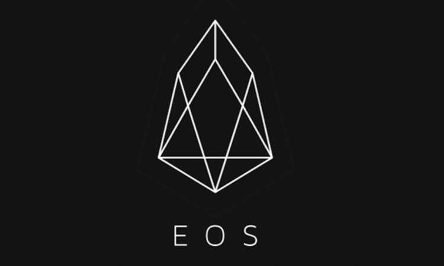
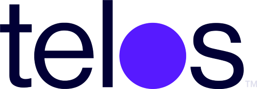

<h2> Hi there 👋, I'm Sham Gir known as ObjectPlayer! </h2>
    

I'm a Blockchain Developer with an experience in multiple Blockchains like EOS(Telos, WAX & its derivative chains), Flow, HyperLedger Indy, Fabric.
I am a problem solver who always thinks about how to solve real-life problems using high-end technology. I am committed to making society free from problems by making every possible business with inherent features – Transparency, Incentivization & Decision-making rights.

This is my CV which was last updated on `18-Jan-2022`.

### Blockchain

  &nbsp;&nbsp; 
  &nbsp;&nbsp;
  &nbsp;&nbsp;
  &nbsp;&nbsp;
 

 

Feel free to reach out on the [Telegram](https://t.me/@ShamGir) directly. And if not available, email me I'll contact you asap.!
